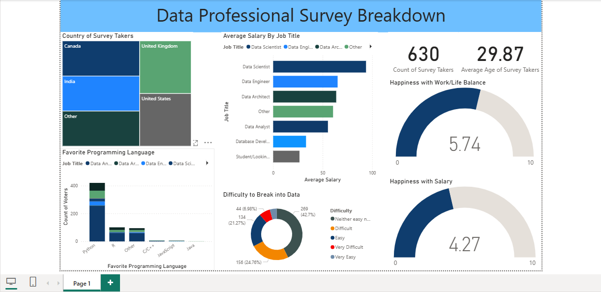

## Project Overview
This project analyzes a global survey of data and tech professionals, uncovering insights into their roles, career paths, and the key factors that influenced their entry into the industry.

## Insights Acquired
* Data Scientists earn higher salaries compared to other professions in the industry
* Python is the most popular programming language among respondents
* On average, professionals salary satisfaction 4.27 out of 10
* Work/life balance satisfaction averaged 5.74 out of 10
* Female professionals reported higher average earnings compared to their male counterparts

## Tools Used
This project was built entirely in Power BI with  with data cleaning performed in Power Query Editor.

## Dasboard Preview

